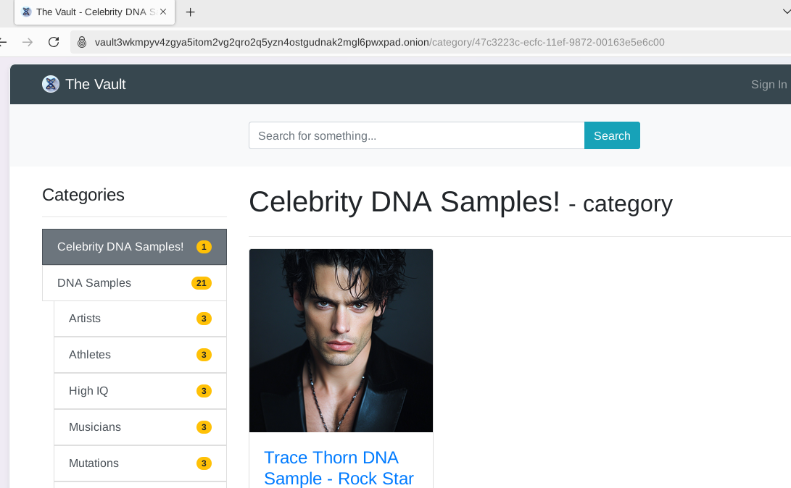
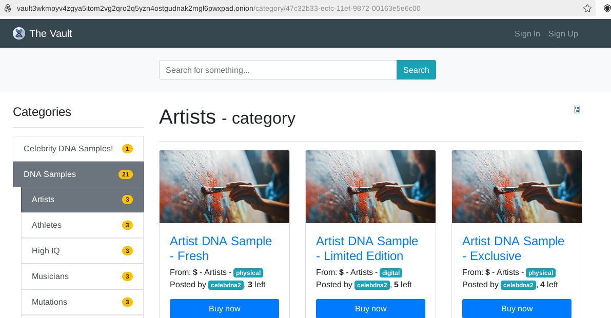

 **theVault**

Welcome to **theVault**! This is a prototype darknet vendor store inspired by:
1.  Goldhat Free Market.
2. The 2024 speculative medical thriller ["Baby X" by Kira Peikoff](https://www.barnesandnoble.com/w/baby-x-kira-peikoff/1143604735), which explores a near-future darknet vendor store selling DNA in the wake of advances in fertilization technologies (available on Amazon, Audible, Barnes & Noble, etc.).

  <strong>LIVE CLEARNET DEMO:</strong> <a href="https://the-vault.website/" target="_blank">https://the-vault.website/</a>

  

  <strong>LIVE ONION DEMO:</strong> <a href="http://vault3wkmpyv4zgya5itom2vg2qro2q5yzn4ostgudnak2mgl6pwxpad.onion/" target="_blank">http://vault3wkmpyv4zgya5itom2vg2qro2q5yzn4ostgudnak2mgl6pwxpad.onion/</a>

  

Goldhat was a legal darknet market-like store launched in 2020, forked from Eckmar's Marketplace (v1). The project was only launched as a beta (no sales) to avoid potential legal liability. It included a major PHP upgrade (from v5 to v8) as well as security enhancements with significant hardening of Nginx. Eckmar's project was orphaned following the release of PHP8 due to breaking changes. Goldhat restricted user-to-user communications and implemented other safeguards to prevent abuse during its public beta. The project was open-sourced after the project author decided moving forward presented too many legal concerns. theVault integrates changes from v1 to v2 of Eckmar's with some of the Goldhat improvements (more coming) as well as custom bugfixes and upgrades for the latest Laravel and Scout versions. Once again, the demo URLs are as follows:

> **LIVE DEMO** http://vault3wkmpyv4zgya5itom2vg2qro2q5yzn4ostgudnak2mgl6pwxpad.onion/
>
> **CLEARNET MIRROR** https://the-vault.website

This is a demo only, thus Sign Up and Sign In are disabled, as is the transaction system (checkout, etc.). Sign up is supported in the free version. Cryptocurrency libraries will need updating. Bitcoin will be easiest to integrate, but any currency can be interfaced. The MoneroRPC project originally used for XMR has been archived, although a fork is still maintained. 

**New to Tor?**
If you haven’t used Tor before, get started by downloading the [Tor Browser Bundle](https://www.torproject.org/download/). It’s free, easy to install, and ideal for safely accessing .onion sites:
1. Download and install the Tor Browser Bundle from the link above.
2. Launch the Tor Browser.
3. Paste the provided .onion address into the browser’s address bar for a secure connection to theVault.

For everyday browsing with enhanced privacy and functionality, consider using the [Brave Browser](https://brave.com/). Brave offers better privacy than Chrome, supports modern web features, and is capable of loading .onion addresses.

## 🚀 Project Overview

**theVault** iterates on the foundations laid by Eckmar's Marketplace and Goldhat Free Market, updating the codebase to utilize **Laravel 11** and **PHP 8.3.x**. Laravel 12 will be supported after its imminent launch.

This project has been tested on Debian and Fedora. Fedora is recommended on the basis that Debian is cruddy and basic. It probably runs fine on almost any Linux, but you'll need to update the installer commands (change dnf, apt, or your package manager accordingly).

### ⚙️ Features

- **Modern Framework**: Built on Laravel 11 and PHP 8.3.16 for enhanced performance and maintainability.
- **Elasticsearch Vectorstore**: Fast searching with the newest Elasticsearch (currently 8.17).
- **OpenJDK**: Updated Java, bundled with Elasticsearch for compatibility.
- **Redis**: Optional Redis 7.2.7 support for improved app performance.

---

## 📦 Installation

### The Vault Community Edition (theVault CE)
Here you will find a fully functional darknet market/store.

#### What's included?

1. A fully functional, darknet-ready market based on PHP 8.3 and Laravel 11.
2. Support for Laravel 12, launching at the end of February 2025.
3. Admin panel.
4. Multi-seller support.
5. Captchas.
6. Semi-automated installation.
7. Quick-start .sql database backup of the demo site (this can be easier than seeder data for bootstrapping).
8. Sample server configuration (nginx).
9. Support for multiple search backends (Elasticsearch for privacy and Algolia for speed; pure SQL is also supported but not recommended).
10. Optional support for Redis.
11. Featured product module (integrated but unimplemented in the demo configuration).
12. Parent and child product categories.
13. Convenience functions for listing vendors and products (top, rising, newest, etc.) primarily using Eloquent.
14. Troubleshooting notes and common administration tasks.
15. Dispute resolution tools.

This version is essentially Eckmar's Marketplace v1 upgraded to PHP8 with some critical bugfixes from Goldhat and the integration of the Featured Products module from EM v2.

#### What's missing?
For $99 you can access additional features not available in theVault CE, including:
1. Load Balancing.
2. Advanced anti-DDoS.
3. Extra security modules.
4. On-market forum.

The following services are available as freelance work:
- Support for any cryptocurrency.
- Walletless payments.
- Server configuration, setup, and support for any Linux distro.
- Pentesting and vulnerability mitigation.

#### Deployment Steps (CE)
1. Deploy on any Linux VM supporting Tor with at least 2GB RAM (Fedora or Debian recommended).
2. Use the automated installation scripts in the `install` directory and refer to the accompanying .txt files for notes and useful commands.

---

### The Vault Pro
*Features not available in the Community Edition require the Pro version, available for an additional $99.*
- Includes all the CE features.
- Load Balancing support.
- Advanced anti-DDoS.
- Extra security modules.
- On-market forum integration.
- Further customization and enterprise support options (available as freelance work upon request).

*Deployment steps follow similarly with additional security configuration options.*

For additional help with Redis, check out this article:  
https://linuxcapable.com/install-redis-on-fedora-linux/

The process is analogous on Debian (using apt with package names ending with `-dev` instead of Fedora's `-devel`). The installer attempts to directly install Elasticsearch; however, it is recommended to comment that out and utilize either the provided repo file for a dnf/yum-based installation or deploy the Docker container from https://elastic.co. Other installation strategies are available on their website.

        sudo dnf install --enablerepo=elasticsearch elasticsearch

---

## 💼 Freelance Support

I offer freelance support as a maintainer or developer for **theVault**. This includes server configuration and setup support for any Linux distro, in addition to assistance with development, maintenance, and security enhancements. Please note that any work I undertake must be legally compliant. If you require assistance, feel free to reach out!

## 📅 Future Updates

- **Laravel 12** is set to launch in less than two weeks. It is recommended to upgrade the project or any forks to stay current with the latest features and improvements.

## 📞 Contact

For inquiries or support, please reach out to me directly. I can be reached on GitHub and LinkedIn.

---

## ⚖️ Legal Disclaimers

1. **No Illegal Activities**: This project is intended for educational and research purposes only. Any use of this software for illegal activities is strictly prohibited.
2. **Compliance**: Users are responsible for ensuring that their use of this software complies with all applicable laws and regulations in their jurisdiction.
3. **No Warranty**: This software is provided "as is," without warranty of any kind, express or implied, including but not limited to the warranties of merchantability, fitness for a particular purpose, and non-infringement.
4. **Liability**: In no event shall the author or contributors be liable for any damages arising from the use of this software, including but not limited to direct, indirect, incidental, punitive, and consequential damages.
5. **User Responsibility**: Users are solely responsible for any consequences arising from their use of this software, including any legal repercussions.

## 🎩 Friendly Advice

Big Brother leverages the Eye of Sauron and has many dungeons. The darknet is filled with hackers and LEAs. If you're thinking of using this code to run a drug market/store or for other arguably illegal activities, please rethink it. You'll get yourself into trouble. Use this to learn or to provide the so-called 'darknet' some much-needed original, non-illegal functionality. Give the gift of possible anonymity to a legal service. If you would like to invest and want a few ideas as well as a business partner, drop me a line.

---

Thank you for checking out **theVault**! Have fun and be good. 🚀
