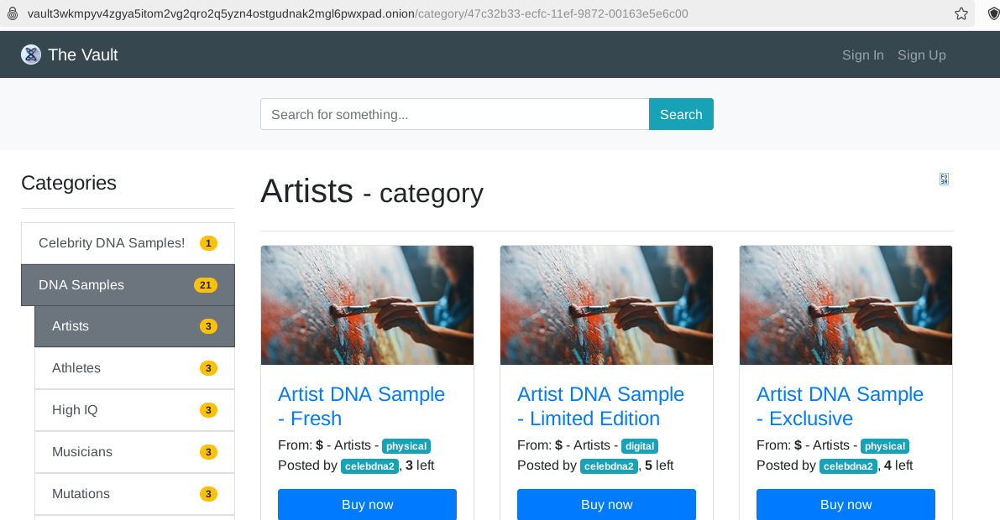

# 🏰 theVault

Welcome to **theVault**! This is a prototype darknet vendor store inspired by:

1. Goldhat Free Market. 
2. The 2024 speculative medical thriller ["Baby X" by Kira Peikoff](https://www.barnesandnoble.com/w/baby-x-kira-peikoff/1143604735), which explores a near-future darknet vendor store selling DNA in wake of advances in fertilization technologies. Available on Amazon, Audible, and Barnes & Noble.

Goldhat was a legal darknet market-like store launched in 2020, which was forked from Eckmar's Marketplace. The project was only launched as a beta (no sales) to avoid potential legal liability. It included a major PHP upgrade (from v5 to v8) as well as a security enhancements with significant hardening of Nginx. Eckmar's project was orphaned following the release of PHP8 due to breaking changes. Goldhat restricted user-to-user communications and implemented other safeguards to prevent abuse during its public beta. 

  
   
  <em>Your trusted darknet vendor store.</em>

> **LIVE DEMO:** http://vault3wkmpyv4zgya5itom2vg2qro2q5yzn4ostgudnak2mgl6pwxpad.onion/

Clearnet demo coming soon.

**New to Tor?**  
If you haven’t used Tor before, get started by downloading the [Tor Browser Bundle](https://www.torproject.org/download/). It’s free, easy to install, and ideal for safely accessing .onion sites:
	1. Download and install the Tor Browser Bundle from the link above.
	2. Launch the Tor Browser.
	3. Paste the provided .onion address into the browser’s address bar for a secure connection to theVault.

## 🚀 Project Overview

**theVault** is a transformation of previous projects into a fully functional vendor store. It builds upon the foundations laid by Eckmar's Market and Goldhat Free Market, updating the codebase to utilize **Laravel 11** and **PHP 8.3.x**.

This project has been tested on Debian and Fedora. Fedora is recommended on the basis that Debian is cruddy and basic. It probably runs fine on almost any linux but you'll need to update the installer commands (change dnf or apt to whatever you're using and map the package names to those for your distro).

### ⚙️ Features

- **Modern Framework**: Built on Laravel 11 and PHP 8.3.16 for enhanced performance and maintainability.
- **Elasticsearch Vectorstore**: Fast searching with the newest elasticsearch (currently 8.17).
- **OpenJDK**: Updated Java, bundled with elasticsearch for compatibility.
- **Redis**: Optional Redis 7.2.7 support for improved app performance.

## 📦 Installation

To get started with **theVault**, follow these steps:

1. Request to pay $99 for the project (XMR, LTC, BTC, or Zelle).
2. Deploy on any Linux VM supporting Tor with at 2GB RAM (Fedora or Debian recommended).
3. Use the automated installation scripts in `install` and see the .txt files for notes and useful commands.

Features:
1. Admin panel.
2. Store or Market mode.
3. Fast search with a selection of local or hosted providers (elasticsearch, algolia, etc.).
4. Parent and child categories.
5. Catpcha.
6. Load-balancer support.
7. Mneumonics.
8. XMR and BTC integration with wrapper-based drop-in support for other currencies.
9. PHP 8.x and Laravel 11/12 support.

For additional help with Redis, check out this article: https://linuxcapable.com/install-redis-on-fedora-linux/

The process is identical for Debian, but uses apt and package names end with -dev in Debian where they are -devel for Fedora. The installer will attempt to directly install elasticsearch for you, but I recommend to comment that out and use either the provided repo file for a dnf/yum-based installation or use the Docker container from https://elastic.co. Other installation strategies are also available on their website.

	sudo dnf install --enablerepo=elasticsearch elasticsearch

## 💼 Freelance Support

I offer freelance support as a maintainer or developer for **theVault**. Please note that any work I undertake must be legally compliant. If you require assistance with development, maintenance, or security enhancements, feel free to reach out!

## 📅 Future Updates

- **Laravel 12** is set to launch in less than two weeks. It is recommended to upgrade the project or any forks to stay current with the latest features and improvements.

## 📞 Contact

For inquiries or support, please reach out to me directly. I can be reached by GitHub and LinkedIn.

---

## ⚖️ Legal Disclaimers

1. **No Illegal Activities**: This project is intended for educational and research purposes only. Any use of this software for illegal activities is strictly prohibited.

2. **Compliance**: Users are responsible for ensuring that their use of this software complies with all applicable laws and regulations in their jurisdiction.

3. **No Warranty**: This software is provided "as is," without warranty of any kind, express or implied, including but not limited to the warranties of merchantability, fitness for a particular purpose, and non-infringement.

4. **Liability**: In no event shall the author or contributors be liable for any damages arising from the use of this software, including but not limited to direct, indirect, incidental, punitive, and consequential damages.

5. **User Responsibility**: Users are solely responsible for any consequences arising from their use of this software, including any legal repercussions.

## 🎩 Friendly Advice

Big Brother leverages the Eye of Sauron and has many dungeons. The darknet is filled with hackers and LEAs. If you're thinking of using this code to run a drug market/store or other arguably illegal activities, please rethink it. You'll get yourself into trouble. Use this to learn or to give the so-called 'dark net' some much needed original, non-illegal functionality. Give the gift of possible anonymity to a legal service. If you would like to invest and want a few ideas as well as a business partner, drop me a line.

---

Thank you for checking out **theVault**! Have fun and be good. 🚀
